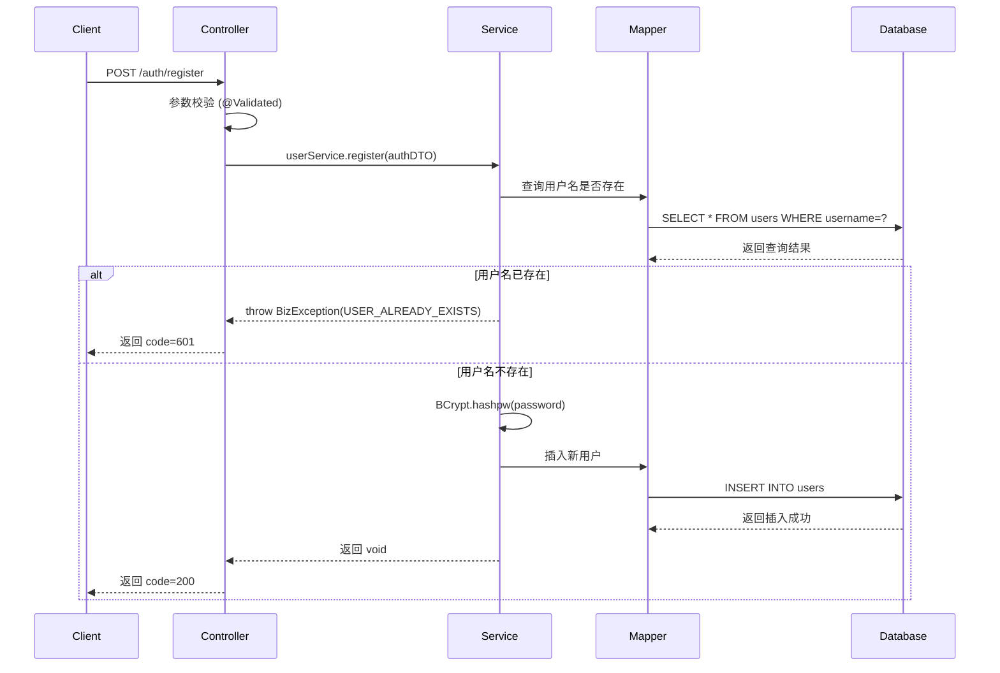
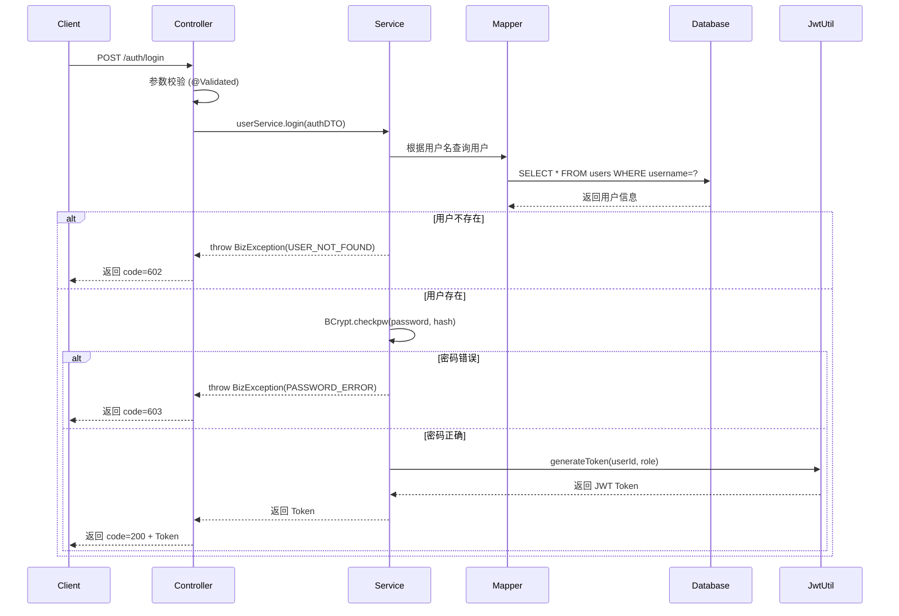

# SoundVibe Auth Module - 架构设计文档

## 📋 模块概述

**vibe-auth** 是 SoundVibe 微服务架构中的用户认证模块，负责：
- ✅ 用户注册（查重 + BCrypt 加密）
- ✅ 用户登录（密码校验 + JWT 生成）
- ✅ JWT Token 生成与验证
- 🔜 Token 刷新（后续迭代）
- 🔜 权限验证（后续迭代）

---

## 🏗️ 项目结构

```
vibe-auth/
├── src/main/java/com/soundvibe/auth/
│   ├── AuthApplication.java                # 主启动类
│   ├── config/
│   │   └── MyBatisPlusConfig.java          # MyBatis-Plus 自动填充配置
│   ├── controller/
│   │   └── AuthController.java             # 认证接口控制器
│   ├── domain/
│   │   └── entity/
│   │       └── User.java                   # 用户实体（对应 users 表）
│   ├── enums/
│   │   └── UserRole.java                   # 用户角色枚举
│   ├── exception/
│   │   └── GlobalExceptionHandler.java     # 全局异常处理器
│   ├── mapper/
│   │   └── UserMapper.java                 # MyBatis-Plus Mapper
│   ├── model/
│   │   └── dto/
│   │       └── AuthDTO.java                # 认证请求 DTO
│   ├── service/
│   │   ├── UserService.java                # 用户服务接口
│   │   └── impl/
│   │       └── UserServiceImpl.java        # 用户服务实现
│   └── util/
│       └── JwtUtil.java                    # JWT 工具类
├── src/main/resources/
│   ├── application.yml                      # 配置文件
│   └── sql/
│       └── schema.sql                       # 数据库初始化脚本
├── pom.xml                                  # Maven 依赖配置
├── API_TEST.md                              # API 测试文档
└── ARCHITECTURE.md                          # 本文档
```

---

## 🎯 核心设计原则（严格执行）

### 1. SOLID 原则
✅ **SRP (单一职责)**:
- Controller 只负责接收请求和参数校验
- Service 只负责业务逻辑
- Mapper 只负责数据访问
- Util 只提供工具方法

✅ **OCP (开闭原则)**:
- UserService 通过接口定义，实现类可扩展
- 使用枚举 (UserRole) 而非魔术字符串

✅ **DIP (依赖倒置)**:
- Controller 依赖 UserService 接口，不依赖具体实现
- 使用 @RequiredArgsConstructor 进行依赖注入

### 2. DRY (不重复自己)
✅ 实现方式:
- 公共字段 (id, createTime, updateTime) 提取到 BaseEntity
- 统一响应格式封装在 Result<T>
- 异常处理统一在 GlobalExceptionHandler

### 3. KISS (保持简单)
✅ 实现方式:
- 使用 Lombok 减少样板代码 (@Data, @RequiredArgsConstructor)
- 使用 Hutool 工具库 (BCrypt, JWT)
- 使用 MyBatis-Plus LambdaQueryWrapper (类型安全)

### 4. OWASP (安全第一)
✅ **输入验证**:
- 使用 Jakarta Validation (@NotBlank, @Size)
- 在 Controller 层通过 @Validated 启用校验

✅ **密码安全**:
- 使用 BCrypt 加密存储 (Salt + Hash)
- 明文密码仅在内存中短暂存在

✅ **SQL 注入防护**:
- 严格使用 MyBatis-Plus LambdaQueryWrapper
- 禁止字符串拼接 SQL

✅ **数据暴露防护**:
- Controller 直接返回 String (Token)，不返回 Entity
- 后续需实现 VO (View Object) 层

---

## 🔐 安全架构

### 密码处理流程

```
[注册]
用户输入明文密码
    ↓
Controller 参数校验 (@Size)
    ↓
Service 使用 BCrypt.hashpw() 加密
    ↓
存储到数据库 (password_hash 字段)
```

```
[登录]
用户输入明文密码
    ↓
Service 从数据库读取 password_hash
    ↓
使用 BCrypt.checkpw() 校验
    ↓
校验通过 → 生成 JWT Token
```

### JWT Token 结构

**Header**:
```json
{
  "typ": "JWT",
  "alg": "HS256"
}
```

**Payload** (自定义数据):
```json
{
  "id": 1,              // 用户 ID
  "role": "PRODUCER",   // 用户角色
  "iat": 1706515200000, // 签发时间
  "exp": 1707120000000  // 过期时间 (7天)
}
```

**Signature** (签名):
```
HMACSHA256(
  base64UrlEncode(header) + "." + base64UrlEncode(payload),
  secret: "soundvibe-secret-2026"
)
```

---

## 📊 数据库设计

### users 表结构

| 字段名        | 类型         | 约束            | 说明                      |
|---------------|--------------|-----------------|---------------------------|
| id            | BIGINT       | PK, AUTO_INC    | 主键 ID                   |
| username      | VARCHAR(50)  | UNIQUE, NOT NULL| 用户名（唯一）            |
| password_hash | VARCHAR(255) | NOT NULL        | BCrypt 密码哈希           |
| role          | VARCHAR(20)  | NOT NULL        | 用户角色 (PRODUCER/ADMIN) |
| create_time   | DATETIME     | NOT NULL        | 创建时间（自动填充）      |
| update_time   | DATETIME     | NOT NULL        | 更新时间（自动填充）      |

**索引**:
- `idx_username`: 用于登录查询优化

---

## 🔄 业务流程

### 用户注册流程



### 用户登录流程



---

## 🛠️ 技术栈

### 核心框架
- **Spring Boot 3.2.0**: 应用框架
- **Spring Cloud Alibaba**: 微服务生态
- **MyBatis-Plus 3.5.5**: ORM 增强工具
- **Nacos 2.3.0**: 服务注册与配置中心

### 工具库
- **Lombok**: 减少样板代码
- **Hutool 5.8.25**: 
  - `BCrypt`: 密码加密
  - `JWT`: Token 生成与解析
- **Jakarta Validation**: 参数校验

### 数据库
- **MySQL 8.0**: 主数据库
- **Redis 7.2**: 缓存（后续使用）

---

## 📈 性能优化策略

### 已实现
1. ✅ **数据库索引**: username 字段添加索引
2. ✅ **MyBatis-Plus 懒加载**: 只查询需要的字段
3. ✅ **日志优化**: 使用 @Slf4j 而非 System.out.println

### 后续优化
1. 🔜 **Redis 缓存**: 缓存用户信息（减少数据库查询）
2. 🔜 **登录限流**: 使用 Redis 记录失败次数（防止暴力破解）
3. 🔜 **异步日志**: 使用 Logback AsyncAppender
4. 🔜 **连接池优化**: HikariCP 参数调优

---

## 🧪 测试策略

### 单元测试（待补充）
- [ ] UserServiceImpl 单元测试
- [ ] JwtUtil 单元测试
- [ ] BCrypt 加密解密测试

### 集成测试（待补充）
- [ ] 完整注册流程测试
- [ ] 完整登录流程测试
- [ ] 异常场景测试

### 压力测试
- [ ] 使用 JMeter 进行并发测试
- [ ] 目标 TPS: 1000+

---

## 🚀 部署清单

### 1. 数据库初始化
```bash
mysql -u root -p < vibe-auth/src/main/resources/sql/schema.sql
```

### 2. 配置检查
- [ ] MySQL 连接信息 (application.yml)
- [ ] Redis 连接信息 (application.yml)
- [ ] Nacos 地址 (application.yml)
- [ ] JWT 密钥 (生产环境建议修改)

### 3. 启动服务
```bash
java -jar vibe-auth-1.0.0-SNAPSHOT.jar
```

### 4. 健康检查
- [ ] 访问 http://localhost:8081/actuator/health (需添加 Actuator)
- [ ] 检查 Nacos 控制台是否注册成功

---

## 📝 代码规范检查

### Lombok 使用规范 ✅
- Entity: `@Data` (可变对象)
- DTO: `@Data` (数据传输对象)
- Service: `@RequiredArgsConstructor` (依赖注入)
- Enum: `@Getter @AllArgsConstructor` (不可变)

### 命名规范 ✅
- Controller: 以 Controller 结尾
- Service: 以 Service 结尾，实现类以 ServiceImpl 结尾
- Mapper: 以 Mapper 结尾
- DTO: 以 DTO 结尾
- Util: 以 Util 结尾

### 注释规范 ✅
- 所有公共类、方法都有 JavaDoc
- 使用简体中文
- 注释说明「为什么」而非「是什么」

---

## 🔮 后续迭代计划

### Phase 2: 增强安全性
- [ ] 添加图形验证码 (使用 Kaptcha)
- [ ] 实现登录限流 (Redis + Lua)
- [ ] 添加登录日志表 (记录 IP、设备、时间)

### Phase 3: Token 管理
- [ ] 实现 Refresh Token 机制
- [ ] Token 黑名单 (Redis Set)
- [ ] 多端登录管理

### Phase 4: 权限系统
- [ ] RBAC 权限模型
- [ ] 接口权限注解 (@RequiresRole)
- [ ] 数据权限过滤

### Phase 5: 第三方登录
- [ ] 微信登录
- [ ] GitHub OAuth
- [ ] Google OAuth

---

## 📚 参考资源

### 官方文档
- [Spring Boot Documentation](https://spring.io/projects/spring-boot)
- [MyBatis-Plus Documentation](https://baomidou.com/)
- [Hutool Documentation](https://hutool.cn/)

### 安全标准
- [OWASP Top 10](https://owasp.org/www-project-top-ten/)
- [OWASP Password Storage Cheat Sheet](https://cheatsheetseries.owasp.org/cheatsheets/Password_Storage_Cheat_Sheet.html)

### 编码规范
- [Alibaba Java Coding Guidelines](https://github.com/alibaba/p3c)
- [Google Java Style Guide](https://google.github.io/styleguide/javaguide.html)

---

**最后更新**: 2026-01-29  
**维护团队**: SoundVibe Team  
**联系方式**: dev@soundvibe.com
